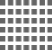

 [](./docs/img/genirsim-logo.png)

# GenIRSim

Quickstart:
```
npm install
npm exec genirsim configurations/default-configuration.json > eval.json
```

To run web server: 
```
npm install
npm exec genirsim-server
```


## Maintenance
```
npm run doc
```
